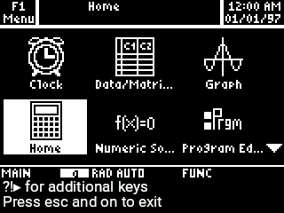

# n-89
TI 89 Titanium emulator for the Nspire

# Screenshots




# Downloading an image file
You may either download the `.89u` file from [TI-Planet], or from [TI 
directly]. However, note that TI is now requiring you to fill out a form
confirming that you aren't using it for an emulator—even though that's
exactly what you're doing with it.

Now, take the `.89u` file and rename it so that it ends with `.89u.tns`.
Now, send that to the calculator, along with the [latest version of
n-89]. Finally, select that image when starting n-89.

Alternatively, you may create a `.img` file with [TiEmu] and load it
with n-89, if you have a ROM dump from a physical TI-89.


[TI-Planet]: https://tiplanet.org/forum/archives_voir.php?id=1863
[TI directly]: https://education.ti.com/en/software/details/en/6633925F6176419197BF6CA051F5F7B4/89ti89tioperatingsystem
[download TiLP]: http://lpg.ticalc.org/prj_tilp/index.html
[downloading TiEmu]: http://lpg.ticalc.org/prj_tiemu/
[latest version of n-89]: https://github.com/lights0123/n-89/releases
[TiEmu]: http://lpg.ticalc.org/prj_tiemu/

# Usage Instructions
After selecting the location of your `.89u` file, you will enter the
emulator. Press the ?:▶ button on your calculator to access the key
picker, allowing you to press any key available on the TI-89. Press the
menu key to access the quick function menu, where you can press F1-F8.
Press both On and Esc at the same time to exit.

# Roadmap
**Note that I currently have no plans to work on any of these (except
saving state), and this emulator is already good enough for my needs**.
However, I would be happy to work on additional features if people are
interested. **Please let me know if you would like to see any of these
features**.

- [x] Direct ROM conversion without TiEmu: there are many issues with
      DLLs on Windows and several issues with building TiEmu on Linux.
      Either having a website with WebAssembly that runs the emulator or
      built into the calculator app would be useful.
- [ ] Saving state support: support for saving the RAM between launches.
      This would greatly speed up startup, and would allow installing
      additional apps and saving variables.
- [ ] Other m68k calculators: This may already be compatible with other
      Motorola 68000-based calculators. However, they are not tested.
- [ ] Other calculators: a TI-84 CE emulator would not be hard to get
      working by porting CEmu.
- [ ] Faster emulator: if anyone would like to improve the TiEmu code or
      (preferably) port it to Rust, that would be extremely helpful.
      There have been no changes to TiEmu since 2007, and it likely can
      be optimized from there. See additional comments on the
      [Reddit thread].

[Reddit thread]: https://www.reddit.com/r/nspire/comments/cmzmic/news_ti_89_titanium_emulator_for_nspire/

# Development
## Prerequisites
- Ndless toolchain installed and added to path
- gcc installed
- Rustup installed
- `jq`
- Unix-like (tested on Linux, most likely Mac and Cygwin will work as
  well)

To install Rust:
```bash
curl https://sh.rustup.rs -sSf | sh
```

## Building
Get started by running `make` to start development. Your .tns file will
be available as `n-89.tns`.

You can toggle debug mode by changing `DEBUG = FALSE` at the top of the
Makefile.
